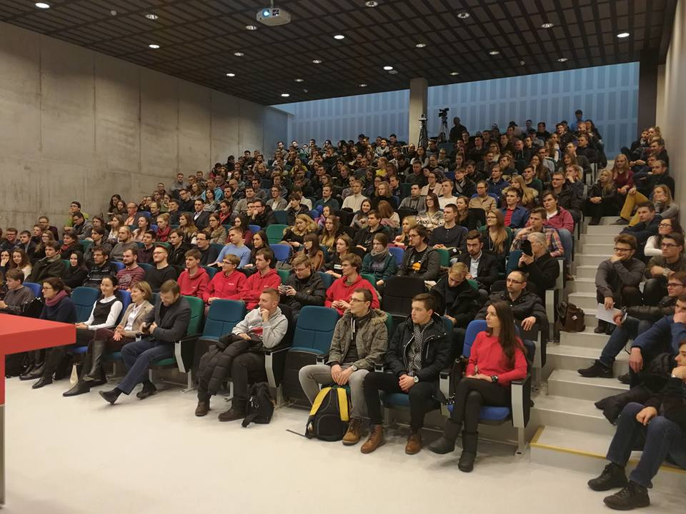
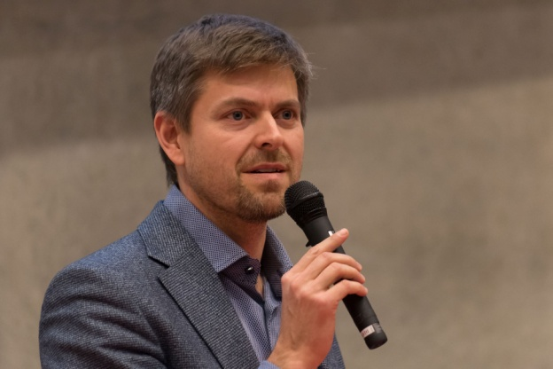

## Įžanga į kursą

Studentui kiekvienas naujas semestras – tarsi galimybė pradėti viską nuo pradžių. Ne išimtis ir šis pavasario semestras. Po sesijos vargų: nauji moduliai, naujos žinios. Pasirinkę Technologijų antreprenerystės kursą, į pirmąją paskaitą žengėme ramia širdimi, jog čia nereikės kasdien „kalti“ teorijos, vartyti milžiniškos apimties konspektų, o ir kurso pavadinimas intriguoja. Tačiau susidūrėme su ne ką  mažesniais iššūkiais. Pirmas modulio reikalavimas – sugalvoti verslo idėją, kurią specialistų pagalba bus galima tobulinti viso semestro metu. Antras iššūkis – blogo kūrimas ir rašymas.

Turbūt daugelis auditorijoje sėdinčių asmenų net nepagalvojo apie asmeninio tinklaraščio rašymą ir štai girdime žodžius: „Semestro eigoje savo mintis, patirtį, idėjas dėstyti privalėsite virtualioje aplinkoje.“ Regis, dar įveikiama užduotis. Tačiau kai antros paskaitos metu teko iš beveik 200 studentų sudaryti grupeles (6-8 žmonės) taip, kad komandos nariai būtų kuo įvairesnių specialybių, pasidarė ne taip ir linksma. Teko surimtėti. Grupę suformavome iš dviejų biotechnologių, trijų informatikos ir trijų maisto technologijos studentų. Kurso kuratorė mums teigė, kad už tokį susiskirstymą po semestro visi studentai visada lieka dėkingi, dėl įgaunamos patirties ir naujų pažinčių. Tikimės, jog tai tiesa ir neteks nusivilti mūsų bendradarbiavimu bei tarpusavio supratingumu. 
         
Vasariui skaičiuojant paskutines dienas, kimbame į darbus. Blogas sukurtas, belieka tik pradėti. Sieksime, jog tinklaraštyje atsispindėtų visų išklausytų paskaitų patirtis, įgytos naudingos žinios. Be abejo, nepamiršim ir savo startuolio, apie kurį užsiminsime šiek tiek vėliau. Taigi pirmyn! O tinklaraščio lankytojams linkime neprarasti kantrybės skaitant!

<figure class="floatRight">
	
	<figcaption>Pirmos paskaitos diskusijos klausytojai</figcaption>
</figure>

## Pirma paskaita

Pirmosios paskaitos metu liko nustebinti ne tik studentai, bet ir kurso dėstytojai. Pasak pastarųjų, dar nėra taip buvę, jog šį modulį pasirinktų toks kiekis studentų. Netilpus gan didelėje auditorijoje, smalsuoliams teko "patogiai" įsitaisyti ant laiptų ir netgi grindų. Tačiau visi nepatogumai nublanko prieš žmogų, kuris tąkart dalinosi savo patirtimi, idėjomis bei patarimais, kaip studijų projektą paversti startuoliu. Tai Ilja Laurs - 2011 m. Europos verslo spaudos asociacijos Metų vadovo titulo laimėtojas, vienas iš 25 Europos technologijų lyderių pagal “Wall Street Journal”. 

Studentai, kurie nelabai žinojo apie patį Technologijų antreprenerystės kursą, pagaliau galėjo suvokti, kad viskas suksis apie verslo pasaulį. Pradėjęs diskusiją su moderatore, Ilja Laurs visų pirmą teigė, kad žmonės siekiantys aukštojo išsilavinimo, būna brandesni. Po studijų, jie kitaip žvelgia į pasaulį, jų siekiai, tikslai visai kitokie. Taip pat, pasak svečio, norint suderinti studijas su darbu yra gan sudėtinga. „Individualaus recepto nėra“, nes kiekviena specialybė yra specifiška, vienur reikalaujama daugiau teorinių žinių, o kitur praktinių. Paklausus, ką jis darytų kitaip, atsidūręs pirmakursio vietoje, Ilja atsakė labai paprastai: reikia viską planuoti, suvokti, ką tu darai ir kaip tu sieki savo tikslo. Tiesiog būtina racionaliai išnaudoti visą turimą laiką.
Būtent ši mintis privertė mus susimąstyti, nes dauguma studentų visgi nemoka dorai suplanuoti savo laiko.

Kalbant apie startuolius, Ilja teigė, jog viską pradėti kuo puikiausiai galima Lietuvoje. Naujų inovacijų ieškojimas, tobulinimas laisvai gali būti vykdomas mūsų šalyje, nes čia viskas pigiau, mažiau konkurencijos, taip pat galima išvystyti idėją daug greičiau. Tačiau reikia nebijoti rizikuoti. „Šviežias“ antrepreneris ne turi, o privalo turėti didelę toleranciją rizikai!  

<figure class="floatLeft">
	
	<figcaption>I. Laurs</figcaption>
</figure>

Idėją startuolio kūrimui Ilja siūlo rinktis iš inovatyviausių sričių šiuo metu. Pasak jo, daugelyje šalių, bakalauro ar magistro studijų baigiamasis darbas dažnai būna tas atspirties taškas savo verslui. Viena iš įdomiausių minčių, įstrigusių paskaitos metu buvo ta, jog dirbant prie baigiamojo darbo, reikia turėti motyvacijos ne tik pačiam, bet ir vadovaujančiam dėstytojui. Abipusis darbas, siekiant panaudoti dėstytojo patirtį gali būti labai vertingas. O jeigu jūsų projektas bus ne tik aktualus šiuolaikiniui sociumui, bet ir įdomus, tai tikimybė, jog darbas virs startuoliu, o ateityje pelningu verslu, ženkliai padidėja.

Labai svarbi mintis – suformuoti gerą komandą, kurti savo pažįstamų žmonių tinklą. Pats Ilja užsiminė, kad savo studijų metais galėjo skirti daug daugiau laiko savo komunikacijos tobulinimui. Taip pat svarbu, turėti reklaminį veidą, pristatantį verslo idėjas visuomenei, nes „beveidis“ verslas pasaulyje nėra populiarus.

Apibendrindami, norime pasakyti, jog sutinkame su beveik visomis Ilja Laurs idėjomis ir mintimis. Pirma, svarbu ieškoti informacijos, siekti tobulėti. Kuriant startuolį reikia atsižvelgti į naujausias inovacijas. Ir mūsų nuomone pats svarbiausias aspektas – nesvarbu ką tu bedarysi, tačiau viskam reikia laiko! Privaloma investuoti į laiką ir pradėti dirbti kuo anksčiau! 

