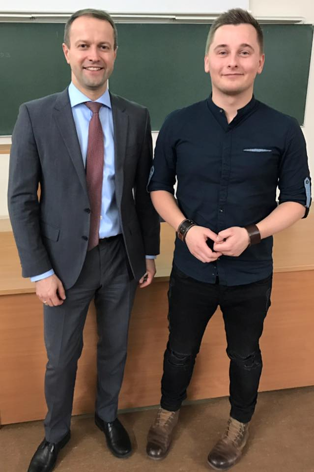
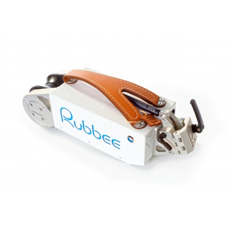

<figure class="floatLeft">
	
	<figcaption>D. Misiūnas ir G. Nemanis</figcaption>
</figure>

Atsigavę po pirmosios paskaitos, suvokę Technologijų antreprenerystės kurso tikslą, po savaitės susitikome diskusijoje "Antrepreneriška lyderystė" su dr. Daliumi Misiūnu (AB "Lietuvos energija" vadovas) bei Gediminu Nemaniu ("Rubbee" dviračio elektrinės pavaros kūrėjas). Gerb. Dalius Misiūnas mums buvo žinomas, tačiau susitikti su Gediminu bei išgirsti apie jo išradimą bei sėkmę buvo kažkas naujo ir įdomaus. 

Pavadinimas „Rubbee“ nemažai daliai studentų buvo girdėtas, tačiau tiksliai, kas tai yra, buvo neaišku. Kai pats Gediminas papasakojo, jog po firmos vardu slypi gan inovatyvus prietaisas, nustebome, jog dar kažkam į galvą gali šauti tokia idėja. „Rubbee“ – tai elektrinė dviračio pavara, kurios maksimalus pasiekiamas greitis yra net 25km/h. 

<figure class="floatRight">
  
  <figcaption>Rubbee</figcaption>
</figure>

Pasakodamas savo sėkmės istoriją, Gediminas motyvavo daugelį mūsų, nes jo patirtis tikrai neeilinė. Dar studijų metais sugalvojęs idėją patobulinti paprastą dviratį, Gediminas praleido ne vieną dieną, o ištisus mėnesius, metus garaže, kur pamažu tobulino savo startuolį. Taip pat ypač sunku buvo atrasti rėmėjų, kurie paremtų naują produktą. Gediminui teko pačiam sėsti į mašiną ir važinėti po Lietuvą, ieškant investuotojų. Tai mums tik įrodo, jog turint tikrai inovatyvią idėja reikia siekti ją įgyvendinti visais įmanomais būdais. Reikia milžiniško užsispyrimo, kurio Gediminui , regis, nepritrūko! Taip pat yra naivu tikėtis, kad viskas pavyks iškart, reikia suprasti, kad net sėkmingiausio lyderio kelyje pasitaiko keblių kliūčių, kurias įveikti retkarčiais yra labai sudėtinga.

Nors „Rubbee“ pristatymas sekė po gerb. Daliaus Misiūno, negalėjome jo aprašyti paskutinio, nes Gediminas įrodė mums motyvacijos, užsispyrimo svarbą verslo kūrimui.

***

O dabar peržvelgsime ir AB "Lietuvos energija" vadovo mintis bei patarimus. Dalius Misiūnas svarbią visai šaliai, jos pramonei sritį „paėmė į savo rankas“ dar 2013 m., tad vadovavimo patirtis dar nėra labai didelė. Tačiau gebėjimas su tuo susitvarkyti vis vien labai žavi. Paskaitos metu Lietuvos pramonininkų konfederacijos viceprezidentas supažindino mus su įžvalgomis Antrepreneriškos lyderystės bei Pramonė 4.0 tematikose. Buvome informuoti apie tai, jog reikia siekti kurti verslo idėją, kuri bus naudinga šių dienų sociumui. Kaip ir praeitos paskaitos svečias, Ilja Laurs, gerb. Dalius patvirtino dirbtinio intelekto svarbą šiuolaikiniam pasauliui. Nes tik vertingos, inovatyvios idėjos bus pripažintos.

Jis taip pat pabrėžė, kad tikimybė, jog pramonės gigantai iš rinkos bus išstumti visada bus mažesnė. Tai įrodo, kad startuoliui įsitvirtinti verslo pasaulyje tikrai nėra lengva. Reikia gebėti manipuliuoti gaunama informacija, reikia domėtis naujausiais išradimais, galinčiais laisvai nukonkuruoti tavo idėją rinkoje. Moralas labai paprastas – jeigu kuri naują verslo projektą, tai taikykis prie žmonių, nes tik jie nulems ar tavo išradimas yra pajėgus įsitvirtinti verslo sferoje. Tik vartojimo lygis gali nuspręsti idėjos sėkmę, nes žmogaus prigimtis visada siekia kažko naujesnio, patogesnio ir aišku pigesnio. Jei konkurentas pasiūlys tokią pat prekę su didesniu funkcijų pasirinkimu, įmantresniu dizainu, šiek tiek mažesne kaina, tai kodėl vartotojas dar turėtų abejoti prieš pasirinkdamas, ką pirkti...

Vadinasi, visada reikia mąstyti keliais žingsneliais į priekį. 
