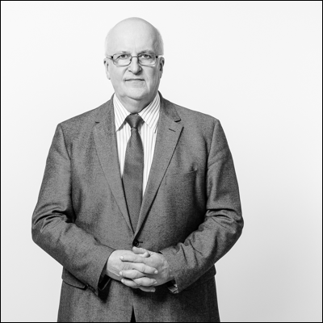
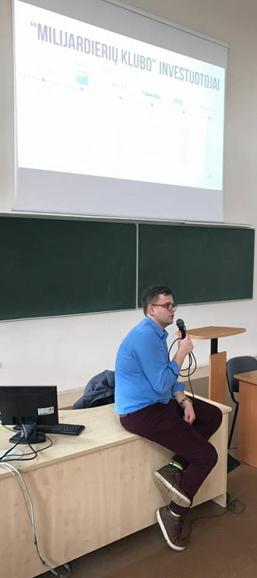

Jau prabėgo beveik mėnuo po Technologijų antreprenerystės kurso pradžios, tačiau kiekviena nauja paskaita tikrai stebina savo svečiais.
Trečiojoje paskaitoje, turėjome galimybę išklausyti kurso globėjų - Justino Taruškos ir Prof. Armino Ragausko – mintis apie startuolius ir kūrybiškumą! 

<figure class="floatRight">
  
  <figcaption>Prof. A. Ragauskas</figcaption>
</figure>

Paskaitoje išvydus garbaus amžiaus profesorių, 
mokslininką, išradėją, kurį dauguma puikiai žinojome, buvo tikrai malonu. Pasidalinti savo patirtimi nepatingėjęs gerb. Ragauskas nustebino mus savo įžvalgumu ir užsispyrimu.
Vos pradėjęs paskaitą jis užsiminė, kad sieks mus ne įkvėpti darbui, bet demotyvuoti.
Tuo metu visa auditorija linksmai klegėjo, tačiau klausydamiesi tolimesnio profesoriaus pasakojimo, turbūt daugelis visgi susimąstė: o gal neverta siekti verslo aukštumų...
Na mumyse po paskaitos motyvacijos dar liko, tad stengsimės jos „neišbarstyti“.

Pasakodamas apie savo gyvenimą, profesorius, kaip ir visi paskaitų metu išklausyti svečiai, nepamiršo patikslinti darbo ir laiko svarbos, tobulinant savo idėją. Dirbęs daugelyje valstybių, dėstęs be galo daug paskaitų gerb. Ragauskas tikino, jog jam be galo malonu bendrauti su mūsų kartos asmenimis. Su tais kurie gyvena technologijų, dirbtinio intelekto tobulinimo laikais. Uždavus įprastą klausimą: ar viską savo gyvenime darytumėte taip pat, jei būtų leistą tai pakartoti, profesorius net numojo ranka teigdamas, kad tikrai ne. „Juk tai ir yra įdomiausia“ – sakė jis. Nežinoti, kas laukia rytoj, ieškant gyvenimo tikslo, įvairių siekių yra įdomu ir vertinga – juk tik taip įgyjama patirtis. Reikia išnaudoti visas galimybes, kūrybiškumą ir siekti to tikslo, dėl kurio norisi aukotis. Ragauskas teigė, jog jeigu bent truputį abejoji, dėl savo galimybių – verčiau nerizikuok! Reikia būt tvirtai įsitikinusiam, jog tikrai to nori ir nesvarbu, ar teks savo darbu nusivilti, tu dėl to blogiau nesijausi.

Mums asmeniškai profesorius A. Ragauskas įstrigo kaip ryški asmenybė. Galėjome mintyse susidaryti vaizdą apie visapusišką žmogų, nes jo paskaita nebuvo vien tik apie verslą, jo kūrimą. Šis žmogus įrodė, jog sėkmingi asmenys nebūtinai turi būti linkę dirbti tik vienoje srityje. Profesoriaus visapusiškumas (domėjimasis politika, filosofija, dėstytojavimas, naujų inovacijų kūrimas ir t.t.) leidžia suprasti, jog žmogaus galimybės išties beribės. Svarbiausia ryžtas, noras ir darbas! Vadovaujantis šiais aspektais galima pasiekti daug įvarių tikslų.

<figure class="floatLeft">
  
  <figcaption>J. Taruška</figcaption>
</figure>

Kitas paskaitos svečias Justinas Taruška taip pat gan visapusiška asmenybė. Jis pranešėjas, dažnas konferencijų dalyvis, „Inside Warehouse” bendraįkūrėjas, „Alchemist” Akseleratoriaus (JAV, Silicio slėnis) alumnis. Jo mintys apie startuolius mums didelio susidomėjimo nesukėlė, nes tai, jog naujų inovacijų pasaulyje dabar tiek daug, mums buvo žinoma. Taip pat savaime suprantama, kad konkurencija rinkoje yra milžiniška. Visi startup’ai, pasak jo, yra rizikingi. 

 Kiek įdomiau buvo klausytis minčių, iš jo pačio patirties, kuomet startuojant su savo idėja, jam teko likti “basam”, beveik be pinigų. Tačiau ryžto dėka, sugebėjęs atsitiesti Justinas visgi pasiekė tai, ko norėjo.

