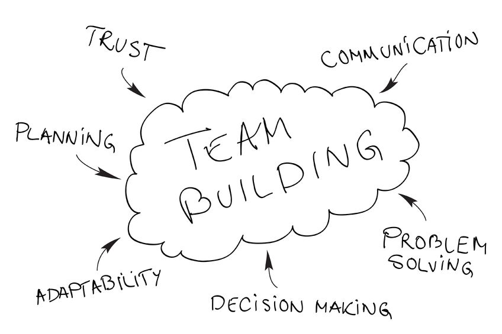

Pavasario pradžia – visuomet daug žadanti. Tačiau šįsyk nekalbėsim apie vis malonesnius orus ar pavasariškas liūtis, nes  mūsų įžanga į šiltesnį metų laiką – dar viena Technologijų antreprenerystės paskaita (JAU KETVIRTOJI!) - skirta verslumo įgūdžiams gerinti. Kaip visada teorinė paskaitos dalis buvo vedama specialistų, žinomų antreprenerių. Šį kartą susipažinome su Monika Laukaite (UAB įmonės Wix.com vadovė) bei lektore Aukse Blažėnaite.

<figure class="floatLeft">
  
  <figcaption>A. Blažėnaitė</figcaption>
</figure>

Auksės Blažėnaitės komentarai apie komandą, jos darbą buvo labai vertingi. Dėstytoja puikiai sudėliojo svarbiausius teorinius aspektus komandai apibūdinti. Žodžiai, kad komanda yra tas pagrindinis komunikavimo vienetas, kur ir turi vystytis idėjos, jų įgyvendinimas, buvo visiškai teisingi. Norint, kad visos komandos veikla būtų sėkminga, reikia nepamiršti, kad komunikuoti tarpusavyje yra būtina. Be abejo, reikia nepamiršti būti ir gerais klausytojais, gebančiais susitaikyti ir su kitų išsakytomis nuomonėmis. Tačiau po šių žodžių sekė gan nemalonus aspektas, kuomet komanda pradeda konfliktuoti tarpusavyje. Pasak A. Blažėnaitės, taip negali būti, kad komanda visą laiką tobulai sutartų. Išties juk visada atsiras asmuo, kuriam nepatiks vieno ar kito nario mintis, tuomet prasideda kritika, nesutarimai. Ir tik tada, kai visi bendrai sugeba išspręsti iškilusias problemas, žmonės galės vadintis tikra, bendradarbiaujančia, darnia komanda.

*Pagrindiniai komandos formavimo aspektai*

Antroji paskaitos viešnia, Monika Laukaitė, pasidalino savo patirtimi komandinėje veikloje. Būdama įmonės „WIX.com“ vadove, ši moteris puikiai suvokia komandinio darbo svarbą ir sunkumus.  Grupę bendradarbiaujančių asmenų  Monika suskirstė į dvi kategorijas: A ir B. A – asmenys, kurie apie jų laukiantį darbą žino mažai, tačiau siekia tobulėti. B – žmonės, kurie save laiko visažiniais. Pasak antreprenerės, jei komandoje yra B kategorijos atstovų, tai nuo jų reikia bėgti, kuo toliau. Šie žmonės nežino, ką reiškia gerinti savo žinias, siekti naudingo komandinio darbo. Jiems įdomūs tik jie patys ir tie asmenys, kurie galėtų su jais konkuruoti – „bent šiek tiek protingesni“. Su tokiais „B“ žmonėmis ne tik neverta prasidėti, bet ir yra visiškai neįdomu dirbti. 

<figure class="floatRight">
  
  <figcaption>M. Laukaitė</figcaption>
</figure>

Pirmasis Amerikos milijonierius Benjaminas Franklinas yra pasakęs: „Investicijos į save neša geriausią naudą“. Šį teiginį iš dalies patvirtino ir Monika. Pasak jos, verta skirti laiko žinių, kitų gebėjimų gerinimui, tarkim, knygų skaitymui. „Improve your skills“ – svarbus aspektas, kuomet savęs tobulinimas gali būti vertingas visai komandai.

Taip pat Monika teigia, kad darbe reikia pamiršti visas asmenines problemas. Jei į darbo interviu atėjęs asmuo pradeda skųstis gyvenimu, tai jo galimybė gauti norimą darbo vietą sumažėja. Taip pat įdomus pastebėjimas, kad team lead‘us komanda turi išsiugdyti pati, nes komandoje atsiradus nepažįstamam vedliui bus sunku dirbti, kol jis adaptuosis aplinkoje, kol suvoks visą darbo struktūrą. Be abejo, nepamirškim, kad tokie asmenys dažnai gali tapti ir *persona non grata* dėl nesugebėjimo komunikuoti su kolegomis ar aplaidaus savo pareigų atlikimo.

Na ir paskutinė mintis – nereikia pamiršti atsipalaiduoti. Juk koks tikslas visą laiką dirbti, jei negalima rasti laisvos minutės poilsiui ir smagiam pasibuvimui su bendradarbiais.

