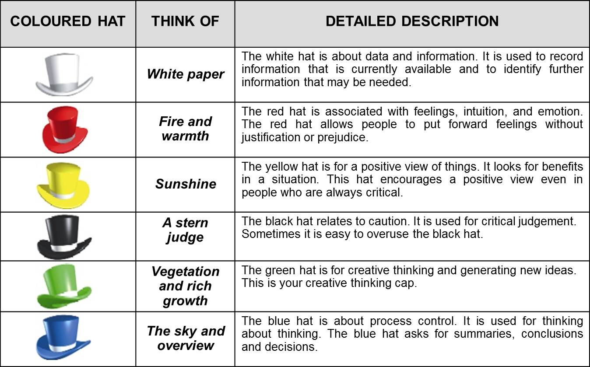

Technologijų antreprenerystės esmė yra idėjos ir inovacijos. Tinklaraštyje kol kas tik dalinomės iš paskaitų svečių išgirstomis mintimis, patirtimis, neužsimindami apie esminį šio tinklaraščio objektą - mūsų komandos idėją. 
Šiame įraše paaiškinsime savo viziją, analizuosime ją pagal Edward de Bono sukurtą "Šešių kepurių" metodą (angl. "Six Thinking Hats").

## Trumpai apie idėją

Miestuose yra daug automobilių. Be visų žinomų privalumų, automobiliai turi akivaizdžius minusus. Tai yra tarša ir kamščiai.
Kamščiai atima daug laiko, o žmonės dabar laiko neturi. Kasdienius dalykus reikia padaryti kuo greičiau. Vienas iš jų - automobilio nusiplovimas.  
Gal atrodo kiek ir pritempta. :) Tačiau plovyklose susidaro didelės eilės. Žinant, kad kiekvienas vairuotojas turi išmanųjį įrenginį, problemos galėtų nebūti, 
o pats atsiskaitymas tapti patogesniu.

Automobilių plovyklų informacinė sistema leistų vairuotojams per savo išmanųjį įrenginį matyti plovyklų taškus žemėlapyje. Žinoti plovyklų teikiamas paslaugas, kainas.
Matyti plovyklų tvarkaraščius, eiles. Prisijungus, užsisakyti norimą paslaugą pasirinktoje plovykle, pasirinktu laiku, iš anksto sumokėti už paslaugą. Tuo tarpu plovyklos galėtų skelbti informaciją apie plovyklą, jos paslaugas.

Klausimas - kas gauna prioritetą? Tiesiai atvažiavęs vairuotojas, ar programėle užsisakęs vairuotojas? Kaip tai suderinti? Ar visų tipų plovyklos galėtų būti sistemoje?
Turbūt sugalvojai ir daugiau kitokių skeptiškų klausimų? :)

Kiekvienoje naujoje idėjoje kyla abejonių, klausimų, neišbaigtumų. Taip ir mūsų. Kaip tuos klausimus visus sugaudyti, ištraukti, išspręsti, kad idėja būtų sėkminga?

## "Šešių kepurių" metodas

Versle dėl pilnai neišgalvotos idėjos gali kilti problemų, arba visas verslo planas gali tiesiog sugriūti, kad ir kiek daug žadanti, inovatyvi idėja buvo.  
Kad to išvengti, [Edward de Bono](https://www.edwdebono.com/) "Šešių kepurių" metodas siūlo idėją išanalizuoti pagal 6-is aspektus (arba užsidėjus šešias kepures) (žr. sekančią schemą).

*Šešių kepurių metodo schema*

## Idėjos analizė

Automobilių plovyklų informacinė sistema analizuojama pagal "Šešių kepurių" metodą:

1. Balta kepurė *(facts)*:

   - miestuose yra daug automobilių;
   - automobilių plovyklose dažnai susidaro eilės;
   - dauguma vairuotojų turi išmaniuosius įrenginius, prieigą prie interneto;
   - plovyklų klientų skaičius skirtingu metų/paros laiku yra netolygus;
   - reikia išsiaiškinti, ar vairuotojai mokėtų už paslaugą jos dar negavę, ar mokėtų daugiau (dėl antkainio);
   - tai išsiaiškinti pavyktų per apklausą.

2. Raudona kepurė *(feelings)*:

   - informacinė sistema būtų naudingiausia vairuotojams, kurių dienos grafikas yra intensyvus, užimtas;
   - naudotojai būtų tie vairuotojai, kuriems už paslaugas patogiau atsiskaityti internetu, kurie nenori gaišti laiko laukiant eilėje;
   - didžiausios eilės yra pavasarį, darbo pabaigos valandomis;
   - plovyklų paslaugos pabrangtų, naudojant automobilių informacinę sistemą.

3. Geltona kepurė *(benefits)*: 

   - informacinė sistema taupytų vairuotojų laiką;
   - būtų mažesnės eilės, mažiau automobilių lauktų eilėse, mažiau nereikalingai išdeginama kuro, mažiau teršiama aplinka;
   - plovyklų pelnas didesnis, nes optimizuojamas plovyklų darbas (yra daugiau darbo).

4. Juoda kepurė *(cautions)*:

   - ar tiesiai į plovyklą atvykę vairuotojai norės naudotis plovykla, jeigu jų laikas nustumiamas už vairuotojų, užsisakiusių nuotoliniu būdu;
   - didesnės paslaugų kainos (dėl antkainio) gali atbaidyti vairuotojus, o plovyklos gali nesutikti teikti paslaugas per informacinę sistemą;
   - informacinė sistema nėra atspari sistemos klaidoms;
   - jeigu įvyksta didžiulė klaida, ar sutrinka serverio/duomenų bazės darbas, plovykla neveikia dėl informacinės sistemos klaidos (plovykla neveikia dėl išorinių problemų).

5. Žalia kepurė *(creativity)*: 

   - plovyklos galėtų naudoti informacinę sistemą ne visoms savo plovykloms (garažams/įvažiavimams/stotelėms), o tik daliai jų, kitos stotelės būtų skirtos vairuotojams, 
   atvažiavusiems tiesiai į plovyklą;
   - plovyklos leistų paslaugas užsisakyti programėle tik tam tikru paros metu;
   - mažas laiko intervalas (pvz. 15 min.) skiriamas programėle užsisakiusiems vairuotojams, kiti 15 min. - tiesiai atvykusiems;
   - informacinė sistema galėtų tik teikti informaciją apie plovyklą, paslaugas, dabar esančias eiles, eilių tendencijas;
   - informacinė sistema būtų skirta tik privačioms plovykloms (garažo plovykloms);
   - plovyklų paslaugų kainoms nebūtų antkainio, jei plovyklos mokėtų abonentinį mokestį už naudojimąsi informacine sistema.

6. Mėlyna kepurė *(process)*:

   - reikėtų išsiaiškinti vairuotojų nuomonę, plovyklų nuomonę, pasiūlymus;
   - idėją būtų galima taikyti tik privačioms plovykloms (garažo plovykloms);
   - privačios plovyklos nėra tokios žinomos kaip didžiųjų tinklų plovyklos;
   - kitos plovyklos (didelių tinklų, degalinių) yra iš dalies ir taip automatizuotos;
   - paslaugos užsakymas programėle nėra būtinas (užtenka tik peržiūrėti paslaugas, eiles, tendencijas);
   - vien tik informacija apie plovyklų paslaugas, eiles, eilių tendencijas vairuotojams būtų naudinga.

Tokia pirma, trumpa mūsų idėjos analizė. Kritiškai įvertinome sugalvotą sistemą naudojant "Šešių kepurių" metodą. Pažvelgėme į esančius faktus, pozityvius aspektus, galimas alternatyvas, įmanomus pavojus.  

Išvada? Kiekvienas komandoje sužinojome daugiau apie savo viziją, pažiūrėjome į ją įvairesniais kampais, pamatėme didesnę paveikslo dalį (dar ne visą paveikslą). Supratome, kad sugalvota idėja iš karto nėra aiški, tai tik pirmas įspūdis, susitikimas su ja.
Tai kaip pažintis su žmogumi. :)

Ateityje taikysime kitus metodus idėjos analizei ir bandysime pamatyti visą paveikslą, idėją. Procesu dalinsimės tolimesniuose tinklaraščio įrašuose.