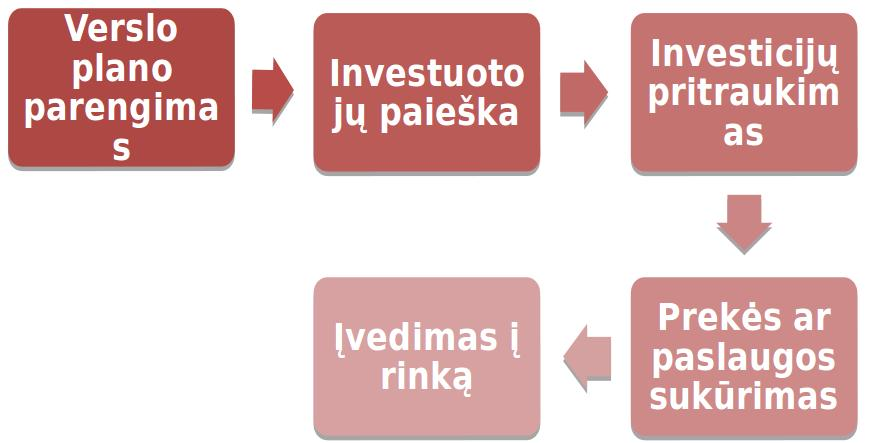
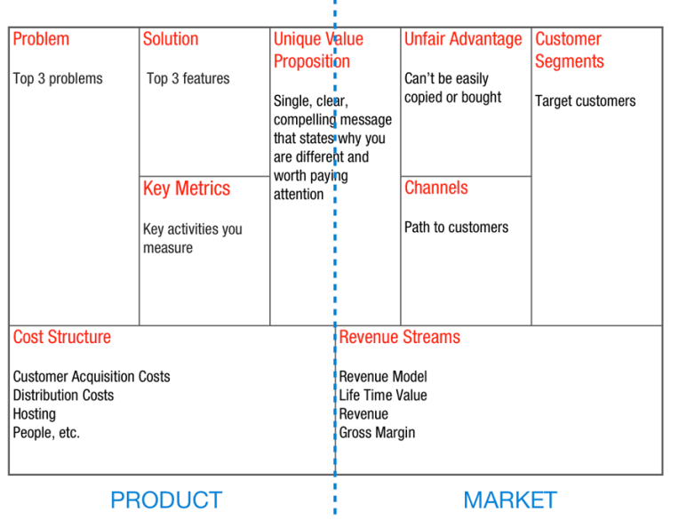
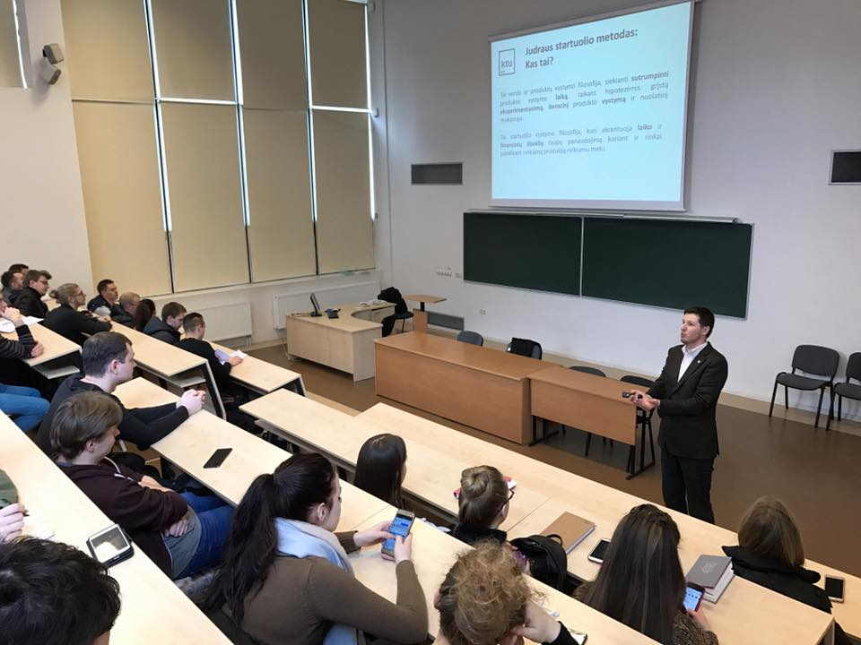
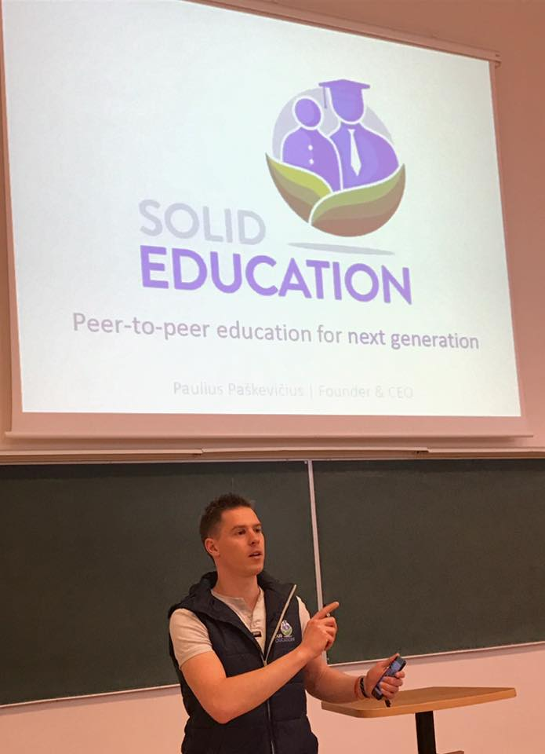

Turbūt daugelis žmonių bent kartą susimąstė apie nuosavą verslą. Tačiau ar tikrai visi žino, nuo ko reikia pradėti tobulinti savo idėją? Kokie yra pirmieji žingsniai tikslo link?  Tradicinio verslo kūrimo (1 pav.) modelis atrodo labai paprastas... Tačiau ar visada jis bus veiksmingas? 

*1pav. Tradicinis verslo kūrimo modelis*

Šį ketvirtadienį vykusioje Technologijų antreprenerystės kurso paskaitoje turėjome galimybę išgirsti pagrindinius aspektus apie jauno verslo metodologiją. Į visą šį inovacijų pasaulį galėjome pažvelgti ir iš teorinės, ir iš praktiškos pusės.  Dažniausias ir turbūt pagrindinis judraus startuolio klausimas: „kaip nežlugti vos pradėjus?“ Visų pirma reikia suvokti, kad judrus ir tradicinas verslo modeliavimas skiriasi... 

<figure class="floatLeft">
  
  <figcaption>2pav. "Lean Business Model Canvas"</figcaption>
</figure>

Kertinėje paskaitoje su verslo kūrimo pagrindais mus supažindino doc. Dainius Martuzevičius. Jis pristatė "Lean Business Model Canvas" - pagrindinį instrumentą su kuriuo dirba daugelis judrių startuolių.
Kadangi dažniausia kurti ir rašyti verslo planus yra ilgas ir varginantis procesas, tai šis metodas, užtikrina efektyvų laiko resursų išnaudojimą. Verslo drobėje (2 pav.) galima aiškiai sudėlioti visas pagrindines idėjas viename lape. Ji gali būti nuolat pildoma ir taisoma. Drobėje atsispindi pagrindinės verslo kūrimo problemos, atsižvelgiama į klientų sektorių, kaštus, sunkių klausimų sprendimus. 

<figure class="floatRight">
  
  <figcaption>D. Martuzevičius</figcaption>
</figure>

Turbūt vienas pagrindinių minėtų judraus verslo principų – inkrementiškas produkto vystymas, atsižvelgiant į tariamai žinomus klientų norus.  Tradiciniame versle taip nėra. Naujas produktas gali būti tobulinimas metai iš metų ir tik tuomet patekti į rinką.
Dainiaus mintys leido mums labiau suvokti, jog pradėti savo verslą nėra taip lengva, kaip daugelis įsivaizduoja. Ypatingai jei tu neatlieki tikslios idėjos analizės, nepasidomi galimais sunkumais ar būsimais klientais. Verslo pasaulis rizikingas, tad jei bijai žlugti, gal net neverta pradėti?

***

<figure class="floatLeft">
  
  <figcaption>P. Paškevičius</figcaption>
</figure>

Kitas paskaitos svečias Paulius Paškevičius (startuolio "Solid Education" įkūrėjas) pademonstravo mums, kaip arodo jo startuolis pagal pirmoje paskaitos dalyje pristatytą metodiką.
„SOLID EDUCATION“ – tai verslo idėja, susijusi su ateities kartų tobulinimu informacinių technologijų srityje. Pagrindinis tikslas – išugdyti daug žadančius programuotojus, rimtus specialistus, nes sprendžiant pagal naujausias tendencijas, informatikų trūkumas po kelerių metų stipriai padidės.

Kad ir kaip įdomiai tai skambėtų, bet šio startuolio klientai – vaikai. Įvairaus amžiaus jaunuoliai yra mokomi programuoti, kurti įvairius žaidimus, programėles. Mums ši idėja – pasitelkti vaikus – labai sudomino. Nepaslaptis, jog naujosios „Z“ kartos atstovai yra imlūs visoms naujovėms, o gyvenimas šalia įprasto kompiuterio – kasdienybė.   Tad argi ne gudru, „sugundyti“ jaunąją kartą savitomis pramogomis, praversiančiomis ateityje?  

Mūsų nuomone, Pauliaus verslo idėja – daug žadanti. Pagrindinis aspektas, kad jis pasitelkia  ateities kartas. Tai geras bruožas, nes visa, kas yra siejama su jaunų žmonių tobulinimu, ugdymu, visuomenėje bus visuomet įvertinta. Kitas svarbus dalykas – informacinės technologijos. Šiuolaikinis sociumas naujų inovacijų taip lengvai nepriima. Tačiau visa, kas su susiję su infromatika, dirbtiniu intelektu, nuolat šmėžuoja topų viršūnėse. 