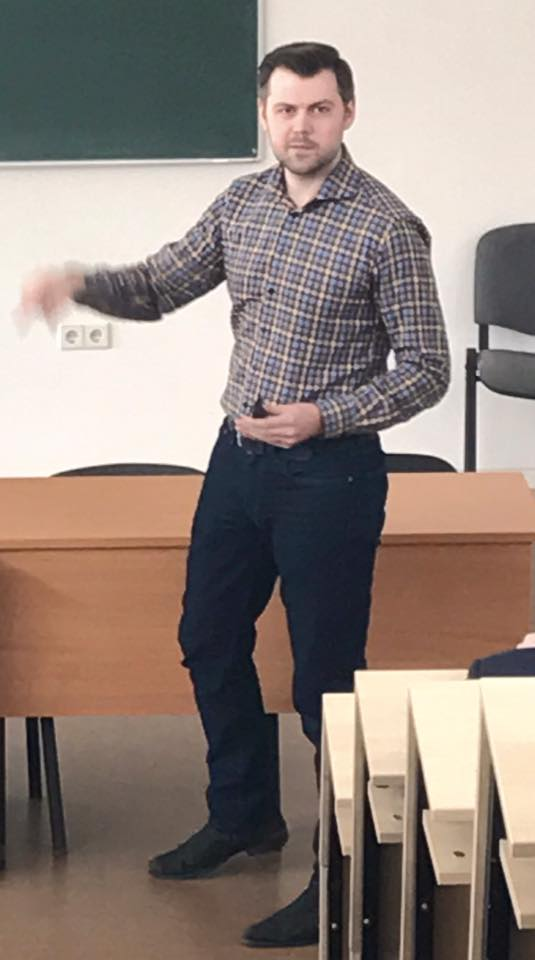
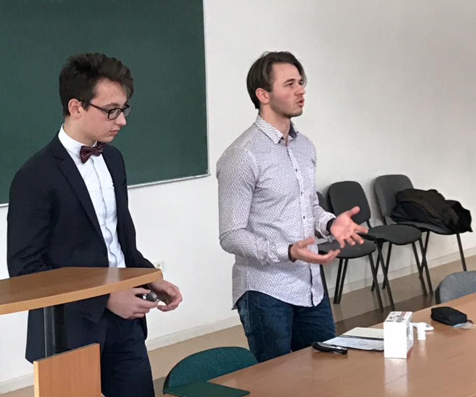

Šeštoje "Technologijų antreprenerystės" paskaitoje apsilankė Arvydas Bložė - "Startup.lt" verslo akseleratoriaus vadovas.
Taip pat, "Sillicon Valley Innovation Challenge" konkurse pelniusios "Best Global Innovation" apdovanojimą idėjos "GlucoCarer" autoriai: Kipras Zabeliauskas ir Rolandas Jakaitis.

<figure class="floatRight">
  
  <figcaption>A. Bložė</figcaption>
</figure>

"Practica Capital" įsteigtas verslo akseleratorius "Startup.lt" padeda vystyti naujas verslo idėjas.
Paskaitoje Arvydas pasidalino naudingais patarimais, kaip reikia pristatyti idėją: ką pristatant reikia akcentuoti, kokias skaidres reikėtų paruošti.

Idėjos turi būti pristatomos greitai, nenuklystant į detales. "Startup.lt" vadovas pasidalino *pitch'o* rekomenduojama struktūra:

  1. Vizija - trumpai pasakoma, kas mes esame.

  2. Sprendžiamos problemos - įvardijamos problemos, kurias išspręstų sukurtas produktas.

  3. Problemos sprendimai būdai - kaip įvardintos problemos būtų išspręstos.

  4. Rinka - kas yra pagrindiniai konkurentai.

  5. Verslo modelis - kokiu būdu bus gautos pajamos, iš ko ir kam bus mokamas atlyginimas.

  6. Produkto aktualumas - ar visuomenei produktas bus reikalingas. Šiam punktui aprašyti reikalinga atlikti apklausą, sudarytą pagal verslo drobę.

Šią struktūrą naudosime ir mes, rengdami savo pristatymą.

***

<figure class="floatLeft">
  
  <figcaption>K. Zabeliauskas ir R. Jakaitis</figcaption>
</figure>

"GlucoCarer" - tai neinvazinis gliukozės matuoklis, kuris yra uždedamas ant ausies. Studentų grupei, kurios nariai yra Kipras ir Rolandas, idėja gimė per tą patį, ankstesnių metų "Technologijų antreprenerystės" kursą.

Paskaitoje Kipras ir Rolandas parengė savo idėjos pristatymo *pitch'ą*.
Per "GlucoCarer" pristatymą sužinojome kokias problemas prietaisas sprendžia. 
Dabartiniai gliukozės matuokliai yra invaziniai, kurie naudoja adatas ir pleistrus. Adatos ir pleistrai turi būti nuolatos keičiami. Kitaip, nei invaziniai matuokliai, "GlucoCarer" neturi nuolatos keičiamų dalių, kurie kainuoja,
nereikia imti kraujo mėginių. Šis prietaisas sutaupytų pinigų daugybei žmonių. 

Reikia pripažinti, kad idėja inovatyvi ir naudinga, nusipelniusi tarptautinio pripažinimo.
Taip pat pamatėme pavyzdį, kaip turėtų atrodyti idėjos *pitch'as* - trumpas, aiškus, turintis aukščiau minėtą struktūrą.

***

Galų galiausiai turėjome parengti savo idėjos bandomąjį tarpinį *pitch'ą*. Su komanda pasitarę 20 minučių, parengėme pakankamai neblogą pristatymą, kuris pritraukė 
auditorijos dėmesį.

Tačiau supratome, kad auditorijai svarbu žinoti ir idėjos aktualumą. Jeigu idėja nebus aktuali, tai ar ji bus kam nors įdomi, ypač finansuotojams?

Prieš tai apklausėme daugiau nei 120 vairuotojų, kurie priklauso įvairioms amžiaus grupėms. Daugumai vairuotojų automobilių plovyklų sistema atrodo aktuali ir naudinga.
Tačiau, mūsų *pitch'e* pritrūko apklausos rezultatų iš pačių įmonių (automobilių plovyklų), kurios naudosis sistema. Turime įsitikinti, ar mūsų iškeltos hipotezės apie 
esančias problemas yra teisingos.

Kitą savaitę pristatysime jau tikrą, galutinį, tarpinį *pitch'ą*. Turime iki tol sužinoti daugiau apie pačias plovyklas, pasišnekėdami su jomis.
Kaip seksis pristatymas ir ką sužinosime apie plovyklas - pasidalinsime tolimesniuose įrašuose. :)

