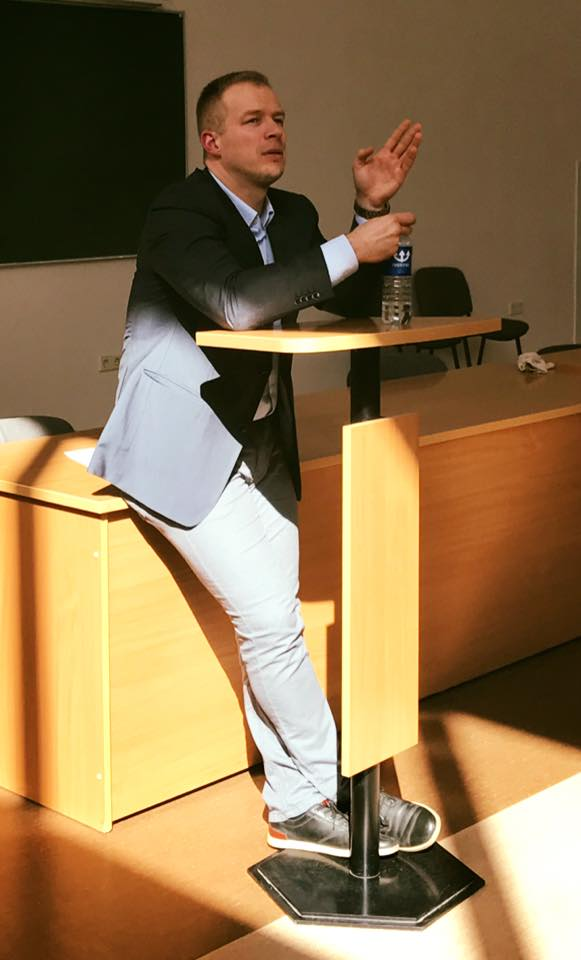

<figure class="floatRight">
  
  <figcaption>A. Maziliauskas</figcaption>
</figure>

Aštuntoje paskaitoje apsilankė Andrius Maziliauskas - verslo konsultantas, turintis didelę patirtį B2B, B2C pardavimų bei investicijų pritraukimo srityse.
Taip pat Salesup.lt pardavimų akceleratorius, bendraįkūrėjas.
Paskaitoje Andrius paaiškino, kuo skiriasi B2B nuo B2C, ko reikia, kad sudominti investuotojus.

B2B (business-to-business) - tai įmonių bendradarbiavimas, vienos įmonės galutinio produkto, paslaugos teikimas kitai įmonei.

B2C (business-to-consumer) - tai įmonės paslaugos, produkto teikimas galutiniam vartotojui.

***

Autoplovyklų platforma plovykloms leidžia teikti paslaugas vairuotojams internetu, programėlės pagalba. Savo paslaugą siūlome plovykloms, todėl mūsų pardavimų tipas - B2B.

Nors atrodo, kad vairuotojai naudojasi mūsų programėle. Galima pamanyti, kad vietoj B2B tipo yra B2C, tačiau esame tik tarpininkas tarp vairuotojų ir plovyklų, ir pajamas gauname iš plovyklų.
Be plovyklų bendradarbiavimo mūsų idėja neveikia. Tačiau, tai nereiškia, kad turime pamiršti vairuotojų poreikius. Turime suprasti, kas jiems patogu, reikalinga.

***

Kas būdinga B2B tai, kai užsiimama šio pardavimų tipo marketingu, svarbu produktą vertinti logiškai, neįpainiojant emocijų (kas labiau būdinga B2C).
B2B atveju reikia surpasti organizacijos (šiuo atveju autoplovyklos) procedūras, aiškiai apibrėžti jas, nustatyti organizacijos rolę. Reikia suprasti, kas yra svarbu įmonei.

Rinka, kurioje veikiama, turi būti konkrečiai įvertinta, pateikiant konkrečius faktus, skaičius. Mūsų atveju - kas naudotųsi programėle, kiek žmonių ja naudotųsi, ar jie mokėtų daugiau už paslaugas.

<figure>
	<blockquote>
		
Svarbiausia pasiruošimas!

	</blockquote>
</figure>

