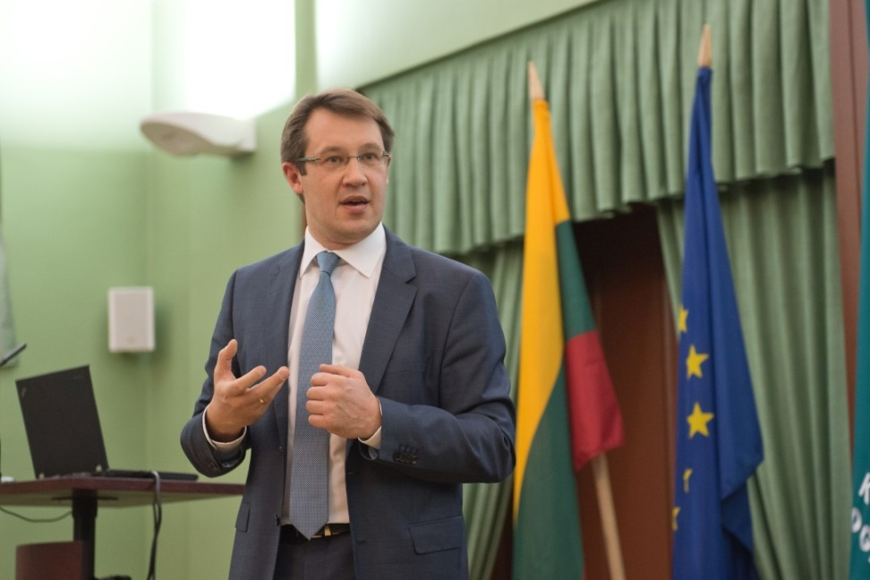

Devintojoje paskaitoje viešėjo prof. Giedrius Jucevičius, kuris mus supažindino su verslo modelių transformacijomis šiuolaikinėse industrinėse ekosistemose. Svečias veda mokymus, seminarus šia tema verslo įmonėms.
Jis yra stažavęsis JAV, Europoje, dirbęs Šveicarijoje, Florencijoje, dėstęs Lundo universitete Švedijoje. Taip pat yra Europos Komisijos ekspertas.
Giedrius iliustruodamas šią temą puikiais ir gausiais pavyzdžiais padėjo mums įsisavinti informaciją apie verslo modelius bei jų kūrimą ir redagavimą.

<figure class="floatRight">
  
  <figcaption>G. Jucevičius</figcaption>
</figure>

Pradėjęs paskaitą profesorius iškart paminėjo, kad verslo sėkmė priklauso nuo gebėjimo savo paslaugą/prekę patraukliai pasiūlyti vartotojui/pirkėjui. Tad galima teigti, jog vartotoją domina ne vien konkretus produktas, bet kur kas daugiau: sprendimai, potyriai, prieiga, parama, pagalba atliekant darbą, net prieiga prie finansų.

Taip pat Giedrius teigė, kad šiuolaikinė įmonių konkurencija vyksta ne tarp siūlomų produktų, bet tarp pačių verslo modelių. Nes būtent verslo modeliu besivadovaudama įmonė pateikia vertę vartotojui ir gauna iš to pajamas. O kiekviena gera technologija ne turi, bet privalo sudaryti gerą verslo modelį. Kiekvienas verslo modelis turi būti kuriamas atsižvelgiant į pačią idėją, produktą bei paslaugą.

***

Praktinėje paskaitos dalyje dėstytojos pamokyti siekėme sukurti tinkamą savo idėjos pristatymą, išskiriant pagrindinius autoplovyklų rezervavimo sistemos bruožus. Tam atlikti reikėjo atsakyti į tris klausimus: Kam? Kas? Kuri? 
Atsakymas paprastas – programėlė skirta vairuotojams, kurie brangina savo laiką, nenori laukti eilėse bei mėgsta reikalus tvarkyti išmaniųjų technologijų pagalba. Programėlė leis greitai ir patogiai užsisakyti automobilio plovimo paslaugą.
Taip pat kartu su kurso mentorių pagalba toliau gryninome savo idėją. Paskaitos metu sprendėme unikalumo klausimus, siekdami išskirti pagrindinius idėjus požymius, bei išskirti matuojamas veiklas. Tam tikslui toliau pildėme savo verslo drobę - "Key Metrics". Kad būtų lengviau tai atlikti, pirmiausia susirašėme tariamus būsimos sistemos bruožus:

- Užsakymas priimamas ir apdorojimas.
- Sistema gan nauja rinkoje, todėl yra nemaža tikimybė, jog vartotojas ja susidomės.
- Sklandus sistemos darbas - geras įspūdis ir vairuotojui, ir plovyklai.
- Galimybė vartotojams palikti atsiliepimus po paslaugų užsakymo.
- Pagrindinės išlaidos - pačios sistemos sukūrimas bei reklama.
- Sistemoje – duomenys apie plovyklas ir jų paslaugas.

Nusprendėme, kad mūsų "Key Metrics":
- Nurodomas programėlės peržiūrų skaičius.
- Nurodomas plovyklų paslaugų rezervacijos skaičius.
- Apps‘o parsisiuntimų skaičius.
- Programos vartojimo dažnis.
- Pajamų kitimo tendencijos.

Pasinaudodami proga pakalbėti su mentoriais bandėme išanalizuoti ir pelno gavimo klausimą. Norint gauti pelną, reikia patraukti vartotojo dėmesį. Kadangi šiuolaikiniui sociumui sutvarkyti reikalus greitai ir kokybiškai yra būtinybė, todėl sistema turi veikti sklandžiai ir nedelsiant. Nusprendėme, jog jei sistema sugeneruos ir pateiks arčiausius plovyklų pasiūlymus vairuotojui greičiau nei per 5 s, tai tikimybė, kad vartotojas naudosis apps‘u bus didesnė, vadinasi ir pelno bus daugiau. 
Pitch‘o metu teigėme, kad turime du galimus pajamų gavimo variantus – siūlyti plovykloms abonementus mėnesiui už sistemos naudojimą. Arba imti tam tikrą procentą, nuo kiekvienos užsakytos paslaugos.

Dėl abonemento kilo labai svarus klausimas. Kažin ar plovyklos sutiks su tuo dėl klientų skaičiaus dinamikos? Išties, klientų srautai gali būti labai skirtingi. Vieną mėnesį jų bus daugiau, kitą mažiau. Tai matydamos plovyklos ims lyginti mėnesio pajamas, jeigu bus dirbama nuostolingai, mūsų paslaugos gali būti ir atsisakyta.

Variantas, dėl tam tikro procento pajamų nuo paslaugos kainos, yra kur kas patrauklesnis. Preliminariai įvertinę paslaugų kainas plovyklose (apie 6 eur už automobilio plovimą), paskaičiavome, jog 1-2 % gauto plovyklų pelno galėtų tekti mums. Gauti 6-12 ct už paslaugą yra įmanomas variantas, nes manome, jog tai radikaliai nepakenks plovykloms, o jos pačios daugiau mokėti ir nesutiktų.