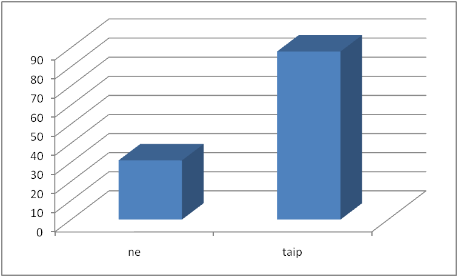
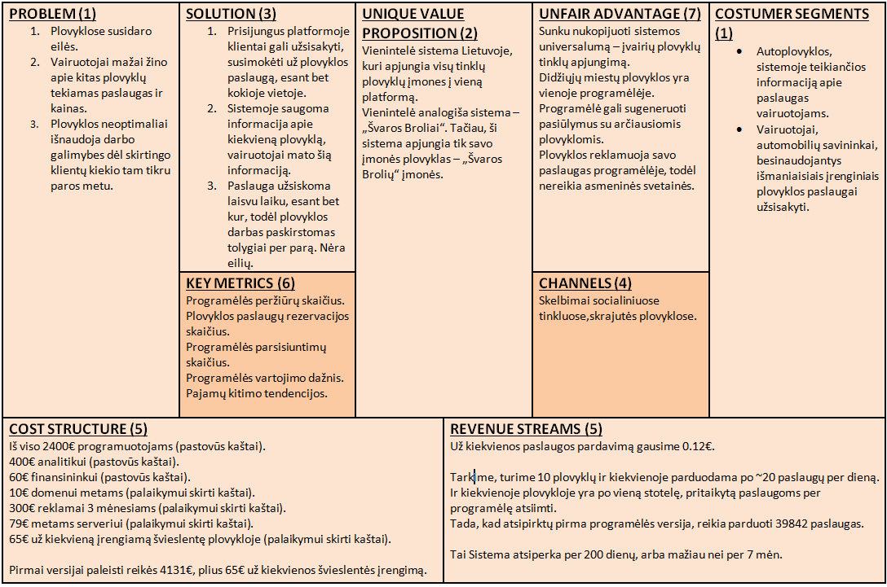

Pitchas, pitchas, pitchas.... šitas žodis iš mūsų galvų neišeina jau keletą mėnesių. Viskas dėl ko dirbom, dėl ko stengėmės, atsispindės jau po savaitės, o dabar metas lengvai treniruotei su gerbiamais kurso mentoriais. Šį ketvirtadienį prie mūsų prisijungė ir Arvydas Bložė, kuris nepagailėjo mums ir kitoms grupėms patarimų dėl idėjos, jos pristatymui. 

Turbūt pasakoti apie savo komandą ir mūsų idėją jau beprasmiška. Viso ko esmė – autoplovyklų rezervavimo sistema. Pristatydami ją, pateikėme savo apklausos rezultatus, problemas, sprendimus, bandėme įrodyti idėjos reikalingumą, taip pat supažindinome auditoriją su verslo finansine dalimi bei pasidalinome verslo drobe.

Kelios ištraukos iš bandomojo pristatymo:

<i>...buvo atlikta vairuotojų apklausa. Iš viso apklausta 119 asmenų, turinčių teisę vairuoti. 26% - teigė, jog programėlė nereikalinga. Neigiamo atsakymo daugiausia sulaukėm iš vyresnio amžiaus žmonių. Neigiamai atsiliepę asmenys teigė, jog turi galimybę susitvarkyti automobilius patys.</i>
  
<figure class="floatRight">
  
  <figcaption>Vairuotojų apklausa</figcaption>
</figure>

<i>... Konkurentų analizė: “Švaros broliai” – plovyklų tinklas, taip pat turintis auto paslaugų rezervavimo sistemą. Tačiau priešingai nei mes, jie apima tik savo tinklo plovyklas, o mes galėtume apjungti skirtingas plovyklas.
Kitos plovyklos kaip  “Auto švaruma” ar “Autobondas” turi internetines  svetaines, kuriose galima rezervuotis paslaugai (appso nėra). Pačios plovyklos savo tinklų neplėtoja. Turi tik po vieną plovyklą. Lokalizuotos mažesniuose regionuose.

Tad mūsų unikalumas ir pranašumas yra tas, kad vairuotojams, kurie brangina savo laiką, nenori stovėti eilėse ir kurie reikalus tvarko išmaniosiomis technologijomis, automobilių plovyklų programėlė siūlo greitai ir bet kur užsakyti plovimo paslaugas…</i>

<figure class="floatLeft">
  
  <figcaption>Galutinė verslo drobė</figcaption>
</figure>

Regis, idėja buvo įvertinta palankiai. Prižadame, kad į patarimus atsižvelgsime!
